# Práctica Final PAT

Se ha seguido con la práctica anterior en la que se realizo una página web de fórmula 1. Como se requerían más páginas, se han añadido varias componentes de venta de entradas, y un pequeño blog donde se pueden introducir posts a traves de un json.
## FrontEnd

Se han hecho un total de 10 vistas, las que ya teníamos antes(index,pilotos,circuitos,formulario,página de agradecimiento) han sido complementadas con(compra de tickets, carrito, perfil, humor y contacto). 
Las páginas existentes no han sido apenas modificadas, añadiendo solo a la barra de indices una nueva opción. Esta opción es un desplegable que nos llevará a las páginas nuevas. 
-La página de contacto es un simple formulario a nivel de front-end. 
-La página de Humor es una página en formato parecido a twitter, con diferentes pequeñas historias o fotos. 
-La página de tickets tiene 3 componentes, un desplegable que te índica todas las carreras(como se ha hecho se explicara en el back-end). Y opciones claramente diferenciadas de tipos de entradas, en cada tipo se podrán elegir una cantidad, habiendo máximos y mínimos. 
-La página del carro esta en un primer momento vacia, con un cartel de carro vacío. Pero una vez seleccionas tus entradas en la zona de tickets, estas aparecen en el carro. Y un botón que lleva a la zona de agradecimientos. 
-Finalmente el perfil, que tiene 2 modos. Si es la primera vez que te metes en la página, te aparecera un breve registro donde tendras que apuntar tu nombre, email y password. Este registro incluye varios tipos de validaciones. El otro modo es una vez te hayas registrado, en vez de poner el formulario, habra la opción de cambiar de contraseña y un boton para hacer los cambios. La página sabe que ya te has registrado porque guardara tu mail en el localStorage. 

Como apuntes extra, hasta que no te hayas registrado no vas a poder comprar entradas, y el boton te llevara a la página de perfil en vez de al carrito. Y una misma persona no puede comprar entradas 2 veces, esto se ha hecho como medida preventiva a los "scalpers". 
## BackEnd

### Bases de datos

Hay 5 bases de datos una de usuarios, una de carrito, una de pilotos, una para guardar los comentarios de la sección de contacto y otra de carreras. 
Varias usan los métodos de AutoIncrementación para evitar colapsos a raiz de IDs nulos o duplicados.  
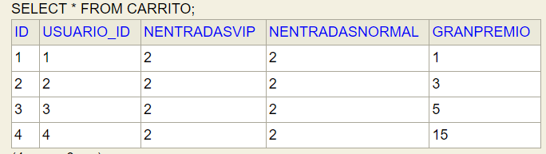
  
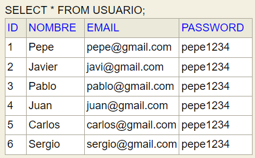
  
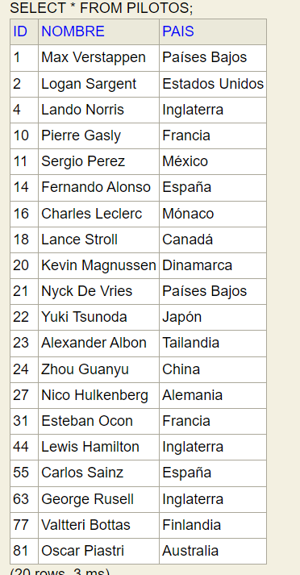
  
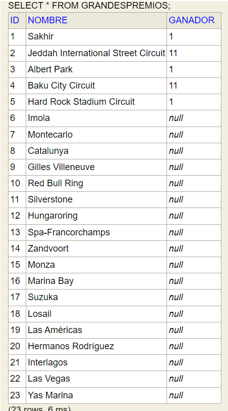
  
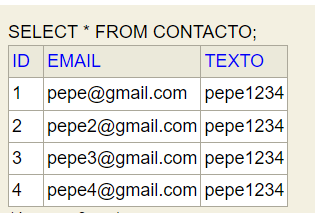
  
  

### Scaffolding
Se ha seguido el método tradicional visto en clase. Con un controlador que contiene los endpoints, una entidad por cada tabla, y un repositorio que permita hacer las Querys a las bases de datos. Y finalmente un servicio, que use las Querys para realizar lo que piden los endpoints.  
Se han realizado todas las Querys a bajo nivel, ya que se tiene mucha más versatilidad y además da menos problemas. Uno de los grandes problemas que se tuvo fue que con los métodos que daba CRUD era complicado guardar algunos de los objetos en la base de datos, pero se solvento fácilmente usando Querys.  

### Endpoints
Se han realizado 6 endpoints, con el fin de conseguir la información necesaria en cada momento de la base de datos.
  
-El primer endpoint es un GET ubicado en /api/carreras/, este endpoint simplemente devuelve todas las carreras en orden, y lo hemos usado para crear el desplegable.  
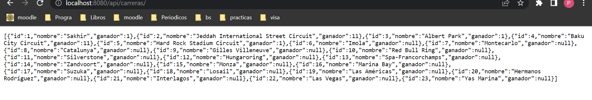  

-El segundo endpoint es un POST en /api/contacto/ y recibe en su body una lista con el email y los comentarios, y los mete en la base de datos.  
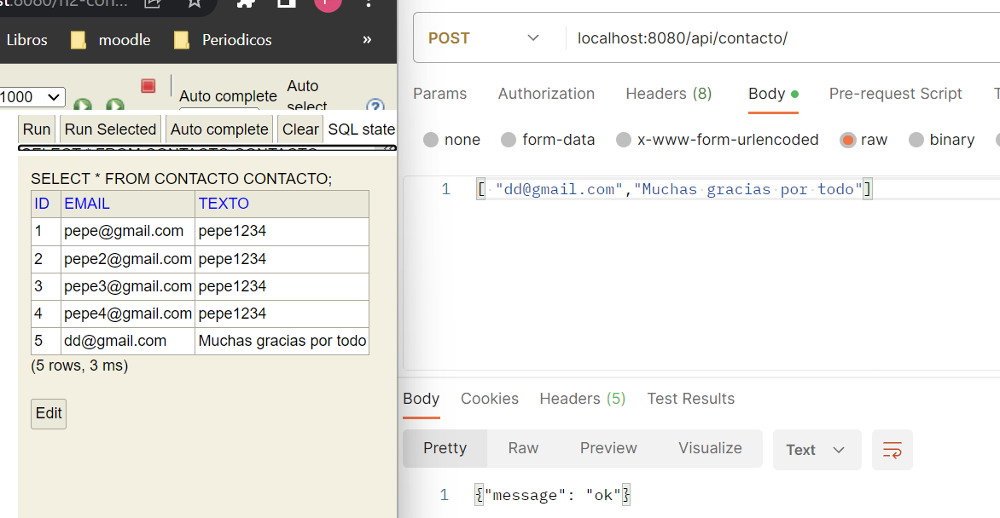
  

-El tercer endpoint es un POST en /api/comprar, y es el que se encarga de recibir cuantas entradas de los dos tipos quiere el usuario, además en su función de servicio se llama a la baase de datos de usuario para obtener el usuarioId que tiene el mail que se esta usando.  
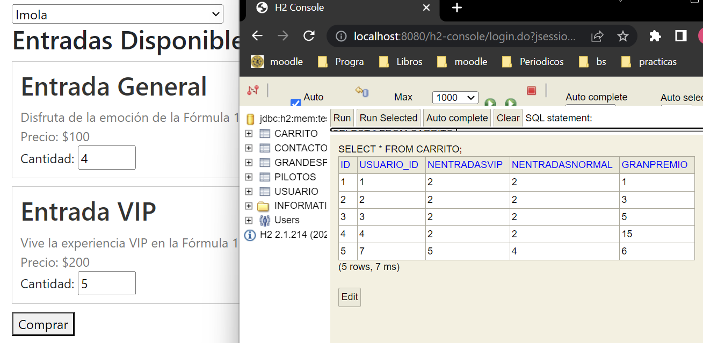  

-El cuarto endpoint es un POST en /api/registrar/ y es el que se encarga de guardar en la base de datos lo que recibe del formulario de creación de perfil.
** Antes  
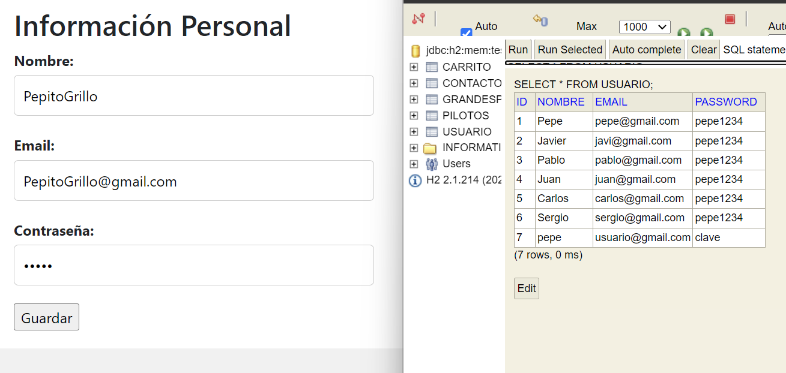  
** Despues  
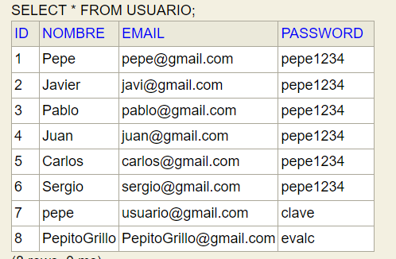
  
-El quinto endpoint es un POST, y esta en /api/chPass. Este recibe una lista con el email, la contraseña nueva y la contraseña antigua, y hace un update en la base de datos cuando coincida el email y la contraseña antigua.
** Antes  
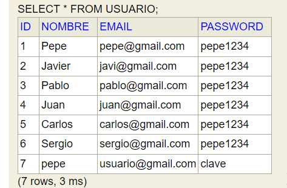
** Despues  
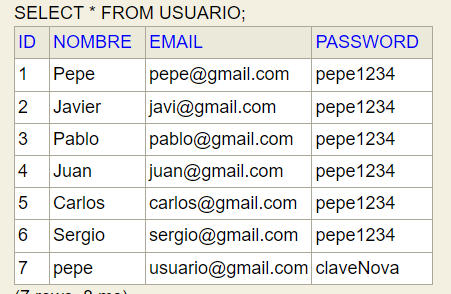
  
-El último endpoint es un GET y esta en /api/carro/{email}. Como se ve, este obtiene los datos de la base de datos carrito que correspondan al mail que pasa y los ponen editados en el carrito.  
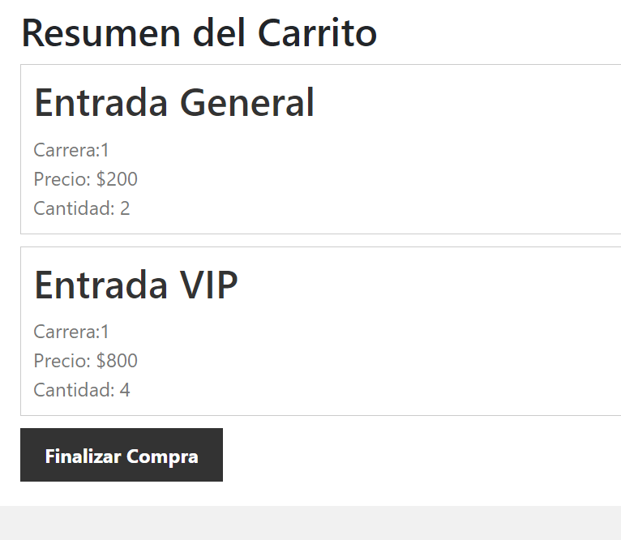
  
La parte que más se complicó fue los inputs que fue complicó por la serialización y deserialización del json pero se acabó solventando.
### Tests

Se han hecho 4 tests.  
-Comprobar que el formulario de contacto funcione. 
-Comprobar que funciona el registro. 
-Comprobar que se puede añadir cosas al carro una vez se sepa el email.
-Comprobar que se puede cambiar la contraseña.
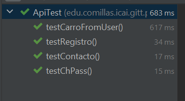